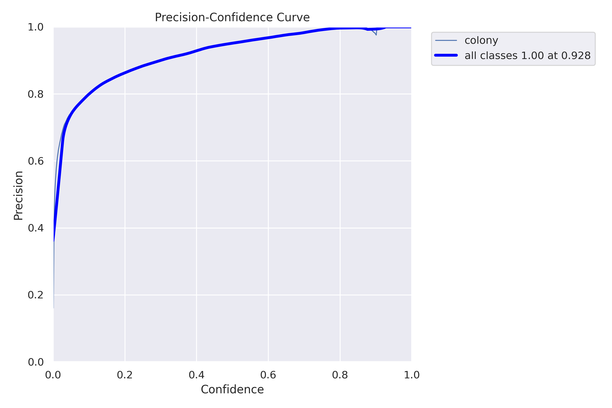
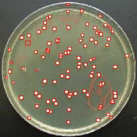

Contains algos that can be used in bioinformatics  
Forexample:  
**primer_search in src/**
* If you want to determine the presence of a plasmide in bacteria via PCR. This
file creates a txt file of primers(showing sequence gc_content and position of
the primer sequence in the plasmide sequence) of the plasmide sequence of a
desired length that contain atleast 40% gc content and start and end  with
atleast 2 bases that are either g or c. These primers are ordered by default
in descending order of gc content

**colony_counter**  
* contains an app and api for countings colonies on an agar plate. Yolov8 was used
for training colony_counter with default arguments and SGD optmizer.
Model was trained using dataset from <https://universe.roboflow.com/test-uhvz8/colony-rxbnn>   

The precision curve  

  

Results  
This is an example with 98 predicted colonies  

  

TODO
* Fine tune the model by trying different optmizers like Adam and other configurations  
* get more data to help generalize better  
